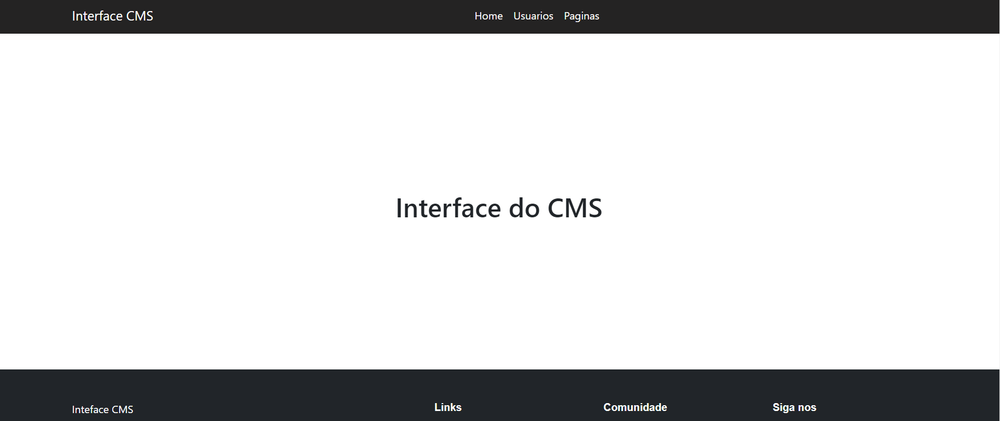
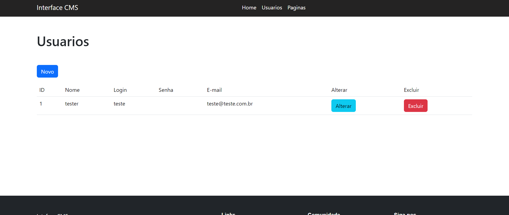
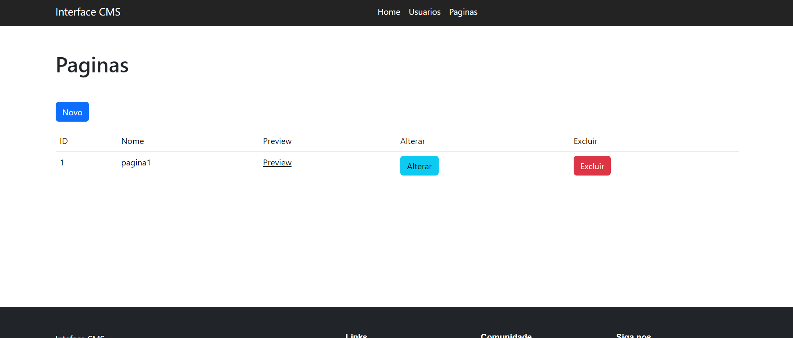

## Pequeno CMS 

Esta é uma aplicação web que consiste em um backend e um frontend, ambos construídos com Node.js. O backend é uma API construída com Node.js, enquanto o frontend é renderizado usando o mecanismo de modelo EJS.

## Preview

## Tecnologias Utilizadas

- Backend:
  - 
  - 

- Frontend:
  - 

- Banco de Dados:
  - 

## Pré-requisitos

- Docker e Docker Compose instalados na sua máquina

# Inicie os contêineres Docker usando Docker Compose:
docker compose up 

# Uso
Abra seu navegador e acesse http://localhost:5000 para visualizar a aplicação.